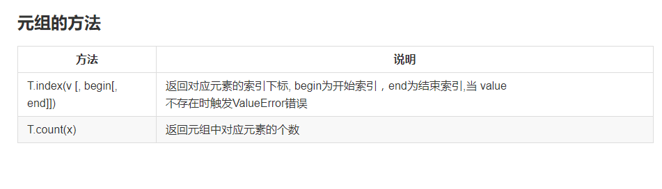

* centent
{:toc}

# Python-容器-元组
## 元组tuple
1. 元组 tuple
   元组是不可变的序列,同list一样,元组是可以存储任意类型的数据的容器  

2. 元组的表式方法
   用小括号() 括起来,单个元素括起来后加逗号(,)区分单个对象还是元组  

3. 创建空元组的字面值  
   t = ()    # 创建一个空元组用t绑定  

4. 创建非空元组的字面值  
```
  t = 200,     # 创建一个只有一个数字200的元组用绑定
  t = (20,)
  t = (1, 2, 3)
  t = 100, 200, 300
```

5. 创建的元组的错误示例:
   t = (20)  t绑定整数20,不是元组  
   x, y, z = (100, 200, 300)  # 序列赋值  
   x, y, z = 100, 200, 300  
   x, y, z = [100, 200, 300]  
   x, y, z = "ABC"   # 序列赋值,不是元组  
   x, y = y, x  # 交换两个变量的绑定关系  

6. type(x)  函数返回x的类型  

7. 元组的构造函数 tuple  
   tuple()    生成一个空的元组,等同于()  
   tuple(iterable)  用可迭代对象生成一个新的元组  
```
  示例:
    t = tuple()
    t = tuple("ABC")
    t = tuple(range(1, 10, 3))  
```
8. 元组的运算  
`+    +=  *  *=`
   t = (1, 2, 3) + (4, 5, 6)  # t=(1,2,3,4,5,6)  
   t = (1,2,3)  
   t += (4,5,6)  # t = (1,2,3,4,5,6)  
   t = (1,2) * 3  # t =(1,2,1,2,1,2)  
   t = (1,2)  
   t *= 3  

9. 比较运算  
   `< <= > >= == !=`  
   比较规则与列表的比较规则完全相同    
* in / not in运算符  
   等同于列表的 in / not in 运算符  
* 索引 和 切片  
   索引取值和切片取值的规则与列表完全相同  
   注: 元组不支持 索引赋值和切片赋值  

10. 元组的方法  


11.序列相关的函数也能用于元组中  
   len(x), max(x), min(x),  
   sum(x), any(x), all(x)  
