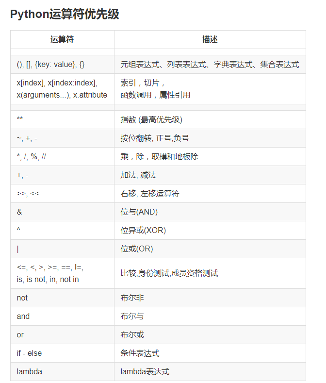
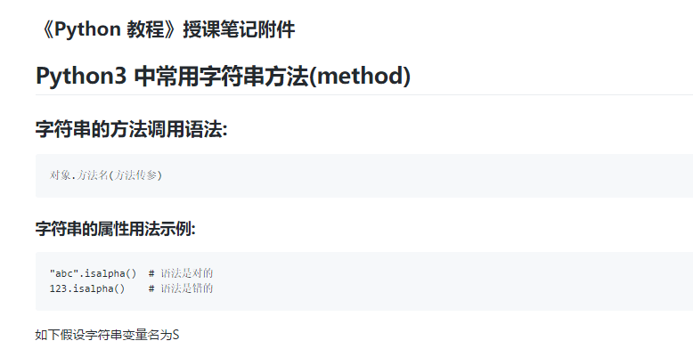
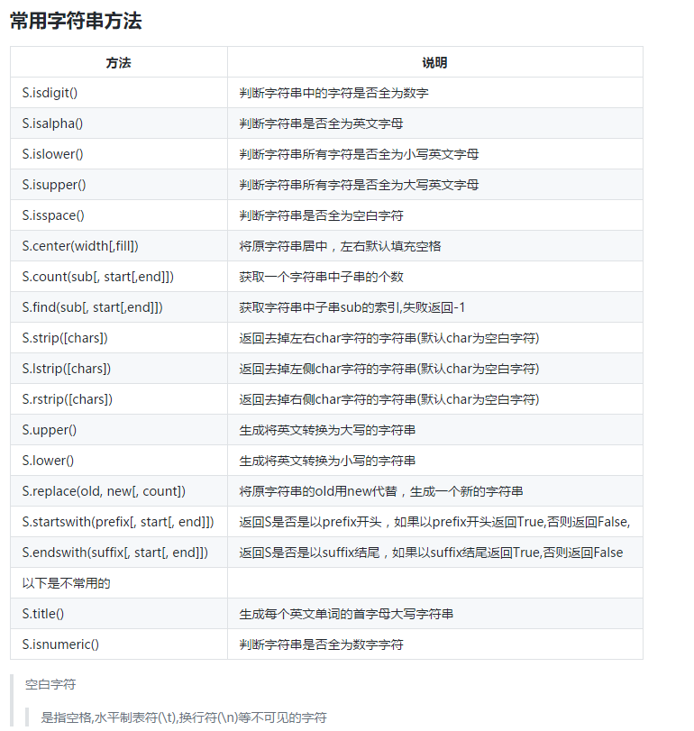

* centent
{:toc}

# Python-字符串  

## 字符串的基本操作  
### 1. 索引 index  
    python字符串是不可以改变的字符序列   

1. 索引取值语法:  
    字符串[整数表达式]  

2. 说明:
    python的序列都可以用索引(index) 来访问序列中的对象， python序列的正向索引是从0开始的，第二个索引为1,最后一个索引为len(s)-1，python序列的反向索引是从-1开始的，-1代表最后一个，-2代表倒数第二个，以此类推。第一个是-len(s) 
```
示例:
    s = "ABCDE"
    print(s[1])  # B
    print(s[4])  # E
    print(s[-1]) # E
    print(s[-5]) # A
    print(s[100])  # IndexError 越界
```

### 2.切片 slice
1. 作用:
    从字符串序列中取出相应的元素重新组成一个新的字符串
2. 语法:
    字符串[(开始索引b):(结束索引e)(:(步长s))]
    注:
      小括号() 括起来的部分代表可省略
3. 说明:
    开始索引是切片开始切下的位置，0代表第一个元素,1代表第二个元素，-1代表最后一个。结束索引是切片的终止索引(但不包含终止点)，步长是切片每次获取完当前元素后移动的方向和偏移量
    1. 没有步长，相当于步长为1(默认为1)
    2. 当步长为正整数时，取正向切片：
       开始索引默认为0,结束索引默认是最后一个元素的
       下一个位置
    3. 当步长为负整数时取反向切片:
      反向切片时，默认的起始位置为最后一个元素，终止
      位置是第一个元素的前一个位置
```
  示例:
    s = "ABCDE"
    a = s[1:4]  # a---> "BCD"
    a = s[:4]   # 'ABCD'
    a = s[1:]   # 'BCDE'  # 等同于s[1:5]
    a = s[:]    # 'ABCDE'  # 等同于s[0:5]
    a = s[1:1]  # '' 空字符串
    a = s[4:2]  # '' 空
    a = s[0:5:2] # 'ACE'
    a = s[4:0:-2]  # 'EC'
    a = s[4::-2]  # 'ECA'
    a = s[::-1]   # 'EDCBA'
```

Python运算符优先级  


### 3.python3中能用于字符串的函数:  
    len(x)  返回字符串长度
    max(x)  返回字符串编码值最大的字符
    min(x)  返回字符串中编码值最小的字符

### 4.字符串的编码转换函数:  
    ord(c)  返回一个字符c的unicode编码值
    chr(i)  返回i这个值所对应的字符
```
  示例:
    x = ord('A')  # x = 65
    c = chr(66)   # c = 'B'
```

### 5.整数转换为字符串的函数:
    bin(i)  将整数转换为二进制字符串
    oct(i)  将整数转换为八进制字符串
    hex(i)  将整数转换为十六进制字符串

### 6.字符串构造(创建)函数:
    str(obj)   将对象转换为字符串
```
示例:
     '123' + 456  # 出错
     '123' + str(456)  # 结果 '123456'
```

### 7.python3中常用的字符串方法(method)
    方法的调用语法:
    对象.方法名(方法传参)
```
  示例:
    'abc'.isalpha()  # 返回True
    '123'.isalpha()  # 返回False
    123.isalpha()   # 出错
```
  方法见文档:
   
   

### 8.字符串格式化表达式
1. 作用:
    生成一定格式的字符串
2. 运算符:
    %
3. 语法格式:
    格式化字符串 % 参数值
    格式化字符串 % (参数值1, 参数值2, 参数值3, ...)
4. 说明:
    格式化字符串中以%开头的字符为占位符，占位符的位置将
    用参数值替换
```
  示例:
    fmt = "name: %s, age: %d"
    s2 = fmt % ("Tarena", 15)

    fmt2 = "年龄: %d"
    s3 = fmt2 % 35
```

### 9.格式化字符串中的占位符类型码
```
   占位符和类型码    含义
    %s        字符串，使用str(x) 函数转换
    %r        字符串，使用repr(x) 函数转换
    %c        整数转为单个字符
    %d        十进制整数
    %o        八进制整数
    %x        十六进制整数(字符a-f小写)
    %X        十六进制整数(字符A-F大写)
    %e        指数形浮点数(e小写) 如: 2.9e8
    %E        指数形浮点数(E大写) 如: 2.9E8
    %f,%F     浮点十进制数
    %g,%G     十进制形式浮点或指数浮点自动转换
    %%        等同于一个%字符
```


#### 占位符和类型码之间的格式语法
```
    %   [ - + 0 宽度.精度 ] 类型码
    -    左对齐(默认是右对齐)
    +    显示正号
    0    左侧空白位置补零
    宽度  整个数据输入的宽度
    精度  保留小数点后多少位(默认为6位)
  示例:
    "%10d" % 123    # '       123'
    "%-10d" % 123   # '123       '
    "%10s" % "abc"  # '       abc'
    '%-5s' % 'abc'  # 'abc  '
    '%05d' % 123    # '00123'
    '%+05d' % 123   # '+0123'
    '%7.3f' % 3.1415926535  # '  3.142'
```

### 10.字符串的文本解析方法 split 和join
1. S.split(sep=None)  将字符串使用sep作为分隔符分割S字符串，返回分割后的字符串列表;当不给定参数时，用空白字符作为分隔符  
2. S.join(iterable)  用可迭代对象中的字符串生成一个中间用S进行分隔的字符串  
```
　示例:
    s = 'Beijing is Capital'
    L = s.split(' ')   # L = ['Beijing', 'is', 'Capital']

    s2 = "##".join(L)  # s2 = "Beijing##is##Capital"
```


